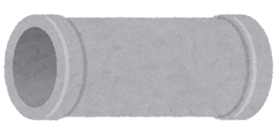

# S3Dokan command line utility
[](https://raw.githubusercontent.com/tuntunkun/s3dokan/master/LICENSE)
[](https://requires.io/github/tuntunkun/s3dokan/requirements)
[](https://github.com/tuntunkun/s3dokan/releases)



The word ‘Dokan’ means 'Pipe' in Japanese, and this command make a pipe which opens into Amazon S3 bucket.

As the name implies, the 'S3Dokan' plays a role of pipe.
And the design of 'S3Dokan' is based on the UNIX philosophy "Simple is the best".
This command simply creates a pipe to the S3 object, so it can be used in combination with any other command line tools which can be used with unix pipe.

## Requirements

* Internet connection
* pre-configured Amazon S3 bucket with appropriate permissions.
* python2.6+ and pip command

### Amazon S3 Bucket
To create Amazon S3 bucket, please refere to the following link.  
http://docs.aws.amazon.com/AmazonS3/latest/gsg/CreatingABucket.html

### Python & PIP
To install python and pip command,
```bash
sudo apt-get install python{,-dev,-pip} build-essential git
```

or if you are on RedHat based linux distributions,
```bash
sudo yum -y groupinstall "Development Tools"
sudo yum -y install python{,-devel,-pip}
```


## Install

```bash
sudo -H pip install git+https://github.com/tuntunkun/s3dokan
```

## Configure

The 'S3Dokan' uses profile configuration of 'aws-cli'.
To configure the profile of 'aws-cli', please refere to the following link.  
http://docs.aws.amazon.com/cli/latest/userguide/cli-chap-getting-started.html

## Usage

Some of the common use cases are shown below.

### Backup HDD Image
```bash
dd if=/dev/sda1 | gzip -c | s3dokan sink s3://backup-bucket/backup-image_yyyymmdd.dmp.gz
```

### Restore HDD Image
```bash
s3dokan source s3://backup-bucket/backup-image_yyyymmdd.dmp.gz | gunzip -c | dd of=/dev/sda1
```

### Backup MySQL Database
```bash
mysql_dump -u root -p -D wordpress | gzip -c | s3dokan sink s3://backup-bucket/backup-wordpress_yyyymmdd.sql.gz
```

### Restore MySQL Database
```bash
s3dokan source s3://backup-bucket/backup-wordpress_yyyymmdd.sql.gz | gunzip -c | mysql -u root -p -D wordpress
```

### Configurable Variable

| Variable  | Option    | Default  | Description                                 |
|-----------|-----------|----------|---------------------------------------------|
| PROFILE   | --profile | default  | profile name which is configured by aws-cli |
| NPROC     | --nproc   | 8        | number of upload/download worker processes  |
| SIZE      | --bs      | 5        | block size of chunk                         |

## License
Copyright (C)2015-2018 Takuya Sawada.

S3Dokan is licensed under the Apache License, Version 2.0 (the "License");  
you may not use this file except in compliance with the License.  
You may obtain a copy of the License at

http://www.apache.org/licenses/LICENSE-2.0

Unless required by applicable law or agreed to in writing, software  
distributed under the License is distributed on an "AS IS" BASIS,  
WITHOUT WARRANTIES OR CONDITIONS OF ANY KIND, either express or implied.  
See the License for the specific language governing permissions and  
limitations under the License.
